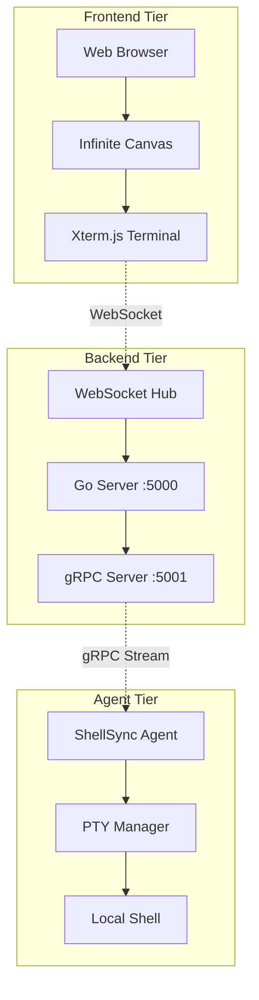

I'll generate a comprehensive README for ShellSync based on the existing codebase structure and documentation. [1](#0-0) 

# ShellSync

**ShellSync** is an open-source, real-time terminal collaboration tool that enables multiple users to share and interact with terminal sessions through an intuitive, infinite canvas interface. [2](#0-1)  Whether you're pair programming, debugging remotely, or teaching command-line skills, ShellSync makes collaborative terminal workflows seamless and efficient.

[](LICENSE)
[](https://github.com/Ayush-Vish/ShellSync)

## ✨ Features

- **🔄 Real-Time Collaboration**: Share terminal sessions instantly with team members via unique URLs, enabling multiple users to view and interact with the same terminal simultaneously [3](#0-2) 

- **🎨 Infinite Canvas Interface**: Dynamic, draggable workspace where you can create, position, and manage multiple terminal windows with zoom and pan capabilities [4](#0-3) 

- **🌐 Cross-Platform Support**: Lightweight agent binaries available for macOS (Intel & Apple Silicon), Linux (amd64 & arm64), and Windows (amd64 & arm64) [5](#0-4) 

- **⚡ Production-Ready**: Built with WebSocket for frontend communication and gRPC for backend-agent interaction, ensuring enterprise-grade performance [6](#0-5) 

- **🔒 Secure & Reliable**: All connections are encrypted, with the agent running locally on your machine to ensure terminal sessions remain secure [7](#0-6) 

## 🏗️ Architecture

ShellSync implements a three-tier architecture designed for scalability and security:



- **Frontend**: React-based UI with infinite canvas interface using WebSocket for real-time communication [8](#0-7) 
- **Backend**: Go server handling WebSocket connections and gRPC streams for session management [9](#0-8) 
- **Agent**: Local Go binary executing terminal commands via PTY and communicating over gRPC [10](#0-9) 

## 🚀 Quick Start

### Installation

Choose your platform and run the installation script:

#### macOS/Linux
```bash
curl -fsSL https://raw.githubusercontent.com/Ayush-Vish/ShellSync/main/scripts/get_linux.sh | sh
```

#### Windows (PowerShell)
```powershell
iwr -useb https://raw.githubusercontent.com/Ayush-Vish/ShellSync/main/scripts/get_windows.ps1 | iex
``` [11](#0-10) 

### Direct Binary Downloads

| Platform | Architecture | Download Link |
|----------|-------------|---------------|
| macOS | ARM64 | [client-darwin-arm64](https://github.com/Ayush-Vish/ShellSync/raw/main/bin/client-darwin-arm64) |
| macOS | x86-64 | [client-darwin-amd64](https://github.com/Ayush-Vish/ShellSync/raw/main/bin/client-darwin-amd64) |
| Linux | ARM64 | [client-linux-arm64](https://github.com/Ayush-Vish/ShellSync/raw/main/bin/client-linux-arm64) |
| Linux | x86-64 | [client-linux-amd64](https://github.com/Ayush-Vish/ShellSync/raw/main/bin/client-linux-amd64) |
| Windows | x86-64 | [client-windows-amd64.exe](https://github.com/Ayush-Vish/ShellSync/raw/main/bin/client-windows-amd64.exe) |
| Windows | ARM64 | [client-windows-arm64.exe](https://github.com/Ayush-Vish/ShellSync/raw/main/bin/client-windows-arm64.exe) | [12](#0-11) 

### Usage

1. **Run the Agent**: Execute `shellsync-agent` to start the local terminal manager
2. **Access Interface**: Open the generated session URL in your browser
3. **Create Terminals**: Use the infinite canvas to spawn and manage multiple terminals
4. **Collaborate**: Share your session URL with team members for real-time collaboration [13](#0-12) 

## 🛠️ Development Setup

### Prerequisites

- **Node.js** (v16+) and **npm** for frontend development
- **Go** (v1.18+) for backend and agent development
- **Git** to clone the repository

### Building from Source

1. **Clone the repository**:
   ```bash
   git clone https://github.com/Ayush-Vish/ShellSync.git
   cd ShellSync
   ```

2. **Build the backend**:
   ```bash
   make run-server
   ```

3. **Build the agent**:
   ```bash
   make build-client
   ```

4. **Start the frontend**:
   ```bash
   cd frontend
   npm install
   npm start
   ``` [14](#0-13) 

## 🤝 Contributing

We welcome contributions! ShellSync is completely open source and free to use. [15](#0-14) 

### How to Contribute

1. Fork the repository: `https://github.com/Ayush-Vish/ShellSync`
2. Create a feature branch: `git checkout -b feature/amazing-feature`
3. Commit your changes: `git commit -m "Add amazing feature"`
4. Push to the branch: `git push origin feature/amazing-feature`
5. Open a Pull Request [16](#0-15) 

## 📋 FAQ

**Q: Do I need to install anything to use ShellSync?**
A: Yes, you need to download and run the lightweight ShellSync agent on your machine. No additional software or complex setup is required. [17](#0-16) 

**Q: Is ShellSync secure for production use?**
A: ShellSync is built with enterprise-grade security. All connections are encrypted, and the agent runs locally on your machine, ensuring your terminal sessions remain secure. [18](#0-17) 

**Q: How do I share a terminal session?**
A: After running the ShellSync agent, you'll receive a unique session URL. Simply share this URL with your team members, and they can join instantly through their web browser. [19](#0-18) 

## 📊 Project Status

- **Latest Milestone**: MILESTONE 4 - Infinite canvas component implemented
- **Status**: Production-ready with minimal server, client, and frontend all operational
- **Binaries**: Available for all major OS/architecture combinations
- **In Progress**: Terminal encryption and session authentication features [20](#0-19) 

## 📄 License

ShellSync is licensed under the [MIT License](LICENSE). [21](#0-20) 

## 📞 Contact

- **Repository**: [https://github.com/Ayush-Vish/ShellSync](https://github.com/Ayush-Vish/ShellSync)
- **Issues**: [GitHub Issues](https://github.com/Ayush-Vish/ShellSync/issues)
- **Email**: [ayushvish6555@gmail.com](mailto:ayushvish6555@gmail.com) [22](#0-21) 

---

**Built for developers, by developers.** [23](#0-22) 
